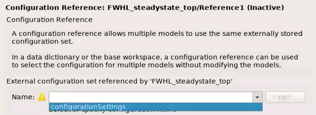
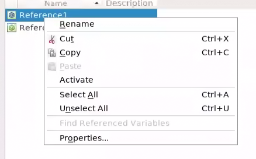
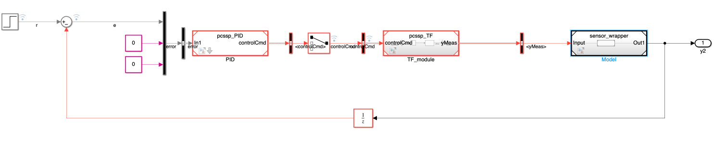

.. _sec-configurationSettings:

Guide on referencing Simulink Configuration Settings
=====================================================

Introduction
-------------

The Simulink configuration stores settings for simulation and code generation of a ``.slx`` model. Configuring it well is a fundamental part of any modeling in Simulink, given that the wrong settings may yield unreliable simulation results (for example a too crude solver skipping over fast dynamics) or errors. In the context of PCSSP, we typically have the following use case:

* PCS modules executing in discrete-time at a fixed rate, for example a PID controller

* Slow continuous dynamics, for example gas injection

* Fast (plasma) dynamics described by stiff (partial) differential equations

* Nonlinearities such as transport delays

* Event-driven modules that are executed only when triggered

The *sample time* of a module is a parameter that indicates when, during simulation, the block produces outputs and if appropriate, **updates** its internal state. For modules containing continuous states, this differs from the internal numerical solver time step, which may vary to optimize the accuracy of the simulation result. For fully discrete models like the PCS modules, the sample time is equal to the solver time step (Simulink does that automatically when the latter is left on auto). Often, a PCS module will have a much larger sample-time than the numerical solver time step that is required for accurate simulation of the continuous plasma dynamics. Simulink therefore supports multi-rate simulations in which each module may have its own sample time, or may be executed on the basis of an external trigger.

In addition to the solver selection and continuous/discrete time considerations, the Simulink Configuration controls archiving, code generation policies, warnings/errors, etc. PCS modules will have massively different requirements compared to plant models, and requirements may differ in which context the module is used. To this end PCSSP implements configuration references. Each ``slx`` module always points to a configuration reference called ``configurationSettings``, whose content is updated at will to configure the model for code-generation, simulation, assessment, etc. These configuration settings are stored in their own dedicated data dictionary container located in the ``/configurations/`` directory in the root of the repository. When initializing or calling the sim method of a pcssp module, the framework takes the ``pcssp_simulation`` configuration settings, and stores them as ``configurationSettings`` in the base workspace. However, when calling the build-method to generate code for a module, ``configurationSettingsRTFcpp`` is called and put in the base workspace with the very same variable name ``configurationSettings``.

In addition, PCSSP top models can point to a ``configurationSettingsTop`` simulation reference, that contains more relaxed requirements and a continuous time solver, allowing faster and more accurate simulations of stiff problems in plasma models.

.. Note::
	The slx model should always point to settings called configurationSettings (or configurationSettingsTop for top-models) in the base workspace of Matlab. PCSSP takes care of updating the content of those settings when building or simulating the model

Settings for simulations
-------------------------

The ``pcssp_simulation`` configuration sets up a continuous time solver for the model to allow accurate simulation of nonlinearities and fast dynamics. Typically, however, a (deployed) PCS module requires discrete sample times. In pcssp, we therefore constrain the input port(s) of PCS modules to force a certain sample time. 'This can be easily configured in the block parameters of the input port. Please refer to the module developer's guide :ref:`sec-moduleDevelopment` to learn how.

Settings for code generation
-----------------------------

Code generation of a PCS module may require, but is not limited to:

* full discrete time with no continuous states

* I/O ports with explicit signal names and data types definitions via non-virtual bus objects

* Disabling errors concerning archiving

* Enabling errors concerning variable-sized signals, or complex signals etc.

In collaboration with the RTF team we recommended a set of Simulink Configuration settings that we have stored under configurationSettingsRTFcpp (for generating c++ code). When calling the ``obj.build('rtf')`` method these settings are stored in the base workspace.

Pointing a new model to the configuration reference
----------------------------------------------------

Out of the box, Simulink will use generic configuration Settings that are as flexible as they can be to support a wide number of cases. These settings are implicitly stored together with the slx model in the 'Configurations' menu of the Model explorer. Instead, after saving a new model, you need to point to the pcssp configuration settings as follows:

Model Explorer → Configurations → Add → Configuration Reference → Point to the configurationSettings that are already in the base Workspace (provided you have initialized the module/module already). Then, right click on the new reference and select *activate*. Without this last step, the model still uses the stock configuration settings. In principle you can delete those by pressing delete on your keyboard.
 
.. figure:: images/modelexp_configRef.png

	Step 1: Add a configuration reference in the model explorer

	Step 2: point to the configurationSettings variable in the base workspace

	Step 3: activate the configuration reference

Configuration References in a hierarchy of models
--------------------------------------------------

In principle, each model in a hierarchy of referenced models will have its own configuration settings when running the model in standalone mode. However, when referencing the model, Simulink typically overwrites most of these settings. In that case Simulink propagates the solver settings of the top model to all referenced models (see `here <https://nl.mathworks.com/help/simulink/ug/set-configuration-parameters-for-model-referencing-1.html>`_). Note that these settings are different from the sample time (block execution): the model is always executed at the Sample Time specified in the ports. In addition, Simulink may allow a local solver in situations where continuous dynamics of a references model are of a vastly different time scale. But this is only ever useful for some simulation proposes, since PCS modules will never contain continuous states. 

With respect to configuration references in PCSSP hierarchies we therefore adopt the following:

* The top model refers to a forgiving configurationSettingsTop  with continuous time solver

* The PCS modules may refer to configurationSettings  for code generation or simulation

* All ports in the models should specify sample times to make sure Simulink interpolates correctly when necessary

When done correctly, we obtain a situation like in the figure below, showcasing how continuous time modules are automatically interpolated to allow communication to fully discrete PCS modules.

	Multi-rate execution of referenced models in a PCSSP top model environment.

References
-----------

* `Simulink Configuration reference help <https://nl.mathworks.com/help/simulink/ug/setting-up-configuration-sets.html>`_

* `Simulink Configuration reference across models <https://nl.mathworks.com/help/simulink/ug/referencing-configuration-sets.html>`_

* `Limitations of configurations in model hierarchies <https://nl.mathworks.com/help/simulink/ug/set-configuration-parameters-for-model-referencing-1.html>`_

