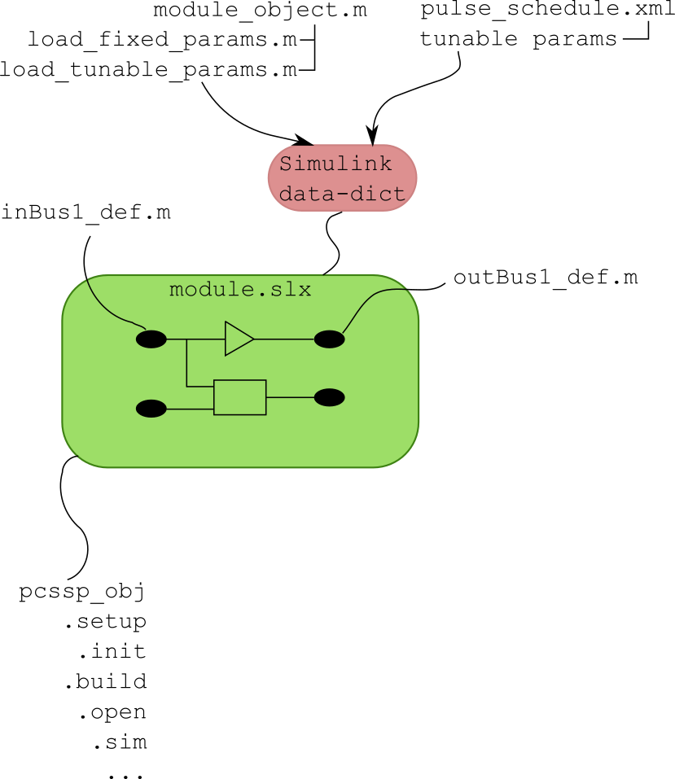
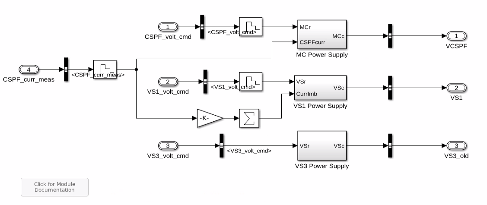
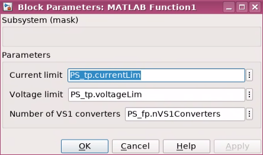

.. _sec-moduleDevelopment:

PCSSP Modules
================================

This Guide shows how new object-oriented modules are developed using PCSSP and the Simulink Control Design Development Suite. Before continuing, follow the steps in the readme.md of the `PCSSP repository <https://github.com/iterorganization/PCSSP>`_ to setup the framework on your local pc.

Module development
------------------------------------

Each PCSSP module is effectively an instance of the pcssp_module class. The resulting object has useful methods to manipulate, open, or build the model. Such an object needs to be instantiated from the PCSSP framework, and needs to be constructed during the development process of the module. The construction of a new PCSSP module therefore starts with defining the following elements:

* a new Simulink model called ``pcssp_<your_module>.slx``
* A matlab script, for example called ``pcssp_<your_module>_obj.m`` instantiating the module, effectively containing:

    * the object definition  ``obj = pcssp_module('pcssp_<your_module>')``. The name ``pcssp_<your_module>`` must match the .slx file name.

* definitions for fixed and tunable parameter structures for the model
* optionally: I/O bus definitions
* Optionally: A main script to initialize, manipulate and run simulations.
* If required you constrain the sample time (i.e. the rate at which the module exchanges signals with the outside)  by setting the sampleTime property of the input ports (see below)
* A class definition to perform basic V&V on your module (see Authoring module tests). This should contain (at least) the following lines:
 
.. code-block :: python 

	classdef pcssp_TF_test < pcssp_module_test % replace 'pcssp_TF_test' with the name of your module
	% test suite for TF pcssp module

    	properties
        	algoobj = @pcssp_TF_obj; % link to your module obj definition here
        	isCodegen = false;
    	end    
	end

The cartoon below schematically puts these elements into context.

	Basic elements of a PCSSP module. An slx-model is connected to various .m scripts containing definitions and a pcssp-module object. 

Templates and examples for these elements can be found under ``templates/`` in the git repository. Next, we will introduce these elements one by one in the following sections.

Module development quick guide
-------------------------------

The recommended approach is to copy all m-files (only the m-files, not the sldd or slx) in one of the subdirectories of the templates/ directory of the pcssp repository, and change them to fit your module's needs:

* Create a fresh, new slx model and save it under pcssp_<your_module>.slx. The model slx filename needs to match the class name in  obj = pcssp_module('pcssp_<your_module>')
* The slx-object and parameter definition scripts need modifying to match your values. Start simple with one dummy value to see if the parameter gets loaded in the data dictionary
* You do not need to copy the Simulink data dictionary file (extension .sldd) since it is created by the framework. The sldd will also be automatically linked to your slx model.
* Define your object by calling obj = pcssp_<your_module>() and try calling obj.init  and subsequently obj.setup to check for any errors.
* Add model complexity and more parameters following the guide in the remainder of this chapter. From here on, you will be simultaneously working in the slx, the parameter definition scripts, and the main obj definition script.
* If needed, constrain the sample time of your module by setting the SampleTime property of the input ports. 
* You can point your model to the recommended PCSSP configurationSettings (containing the time vector, solver etc. for Simulink). This object is automatically put in the base workspace when you call init or setup. A how-to is provided in Section :ref:`sec-configurationSettings`.

Module slx file
--------------------

	example PCSSP module with input and output ports, and various Simulink blocks.

An example PCSSP module is shown in the figure above. Like any Simulink model, this module contains input ports, output ports, and blocks in between. You are free to use any Simulink capability/blocks in your model, for example Matlab function blocks, rate limiters, etc. However, we will list some modeling guidelines and considerations at the end of this chapter.

Generally speaking the parameters inside the model blocks should not be hardcoded: It is better to centralize the parameter values to allow their traceability and configurability. In PCSSP, the model blocks are configured using two types of structured parameters (Matlab structs) namely 1) tunable parameters, and 2) fixed parameters. So instead of writing a hardcoded ``5`` in the value field of a block, we would write for example ``pcssp_PowerSupplies_tp.rateLimit``. The actual value of this parameter is taken from the data dictionary that is automatically filled and linked to your module slx.

During module development, you therefore have to simultaneously update the script that contain the parameter structure definition (i.e. pcssp_PowerSupplies_loadtp in the example below) and the Simulink model. Since parameters only appear in the data dictionary after model initialization it is best to start with a basic, working example, and extend the parameter list from there.

As a developer of a PCS module earmarked for code generation you have to decide to which category a parameter in the model belongs: Tunable parameters may change from one ITER discharge to the next (during initialization) or during real-time execution. Fixed parameters are hardcoded (inlined) and cannot be changed without recompiling the code.

For PCSSP modules that will not run in real-time (e.g. plant models used for assessment) there is no fundamental necessity of making any distinction in parameters. In fact, tunable parameters in Simulink models cannot be used everywhere, since Simulink must support changing them in real-time. Sizes of signals and block sample times are examples of parameters that cannot be tunable. 

The structure containing fixed and tunable parameters is directly used/called in the underlying module, see the snippet below:

	Example of calling pcssp module parameters in the Simulink blocks.

 

The name of the ``PS_tp`` and ``PS_fp`` structures, and the values therein are defined in the object definition. This is the topic of the next section. The slx model may also use PCSSP recommended configurationSettings for the solver, error handling, time vector, etc. This is discussed in Section :ref:`sec-configurationSettings`. 

Object definition
------------------

The pcssp module object contains methods to manipulate and initialize the module. It inherits the ``pcssp_module`` class and sets the timing of the module execution. Then, it defines parameters, and (optionally) the module input/output buses. For this module, the latter are all grouped in a single definition script.

.. code-block :: python

	function obj = pcssp_PowerSupplies_obj()
		% PCSSP PowerSupplies Module for PFPO-1
		% CREATE - Napoli
		% Timo Ravensbergen - IO
		% Relies on 'SCDDS-core' Object-Oriented backend

		obj = pcssp_module('pcssp_PowerSupplies');

		%% Timing of the algorithm
		obj=obj.settiming(0,1e-3,10.0);

		%% Fixed parameters init functions 
		obj=obj.addfpinitfcn('pcssp_PowerSupplies_loadfp','PowerSupplies_fp');

		%% Tunable parameters structure name
		obj=obj.addtunparamstruct('PowerSupplies_tp', @()pcssp_PowerSupplies_loadtp());

		%% input and output buses
		obj = obj.addbus('',@()pcssp_PowerSupplies_busdef);

		%% Tasks

		%% Print (optional)
		obj.printinfo;

	end

  

The ``pcssp_PowerSupplies_loadfp``  and ``loadtp`` functions simply populate structures with parameters, for example:

.. code-block :: python

	function TP = pcssp_PowerSupplies_loadtp()
	
		TP.currentLim = [0 55 200]*1e3;
		TP.voltageLim = [1.2 1.05 1.05]*1e3;

		TP.VS3Vup  = 1e3*2.3;
		TP.VS3Vlow = -1e3*2.3;

	end

The output of which is assigned to ``PowerSupplies_tp`` in the object definition.

Constraining block execution
-----------------------------

Real-life controller modules are typically discrete time to allow embedded execution. We can simulate this behaviour in simulink by controlling the block execution. The rate at which Simulink models exchange signals with the outside can be set using the sample time property of blocks and ports. Note that this may be different from the numerical solver time step when you use a continuous-time solver. For discrete-time solvers, the sample time is always the same as the solver time step.

In Simulink, the sample time propagates throughout the model. As a consequence, setting the sample time of an input port **constrains the execution of the full model**. This is a useful feature to simplify your modeling, and individually setting the sample time of blocks is therefore not recommended. PCSSP modules are shipped with a obj.gettiming method which can be used to uniquely define the sample time of your module. However, this still requires access of the model to the base workspace where the module obj is stored. We therefore recommend to put the sample time in a fixed-parameter structure as follows:

.. code-block :: python

	function fp = pcssp_PID_sensor_loadfp(obj)

	%% timing of the module
	fp.timing = obj.gettiming;

	%% Load other fixed parameters
	fp.delay = 0.002;

	end

Note that this only puts the timing information in the fixed parameter structure. You still need to set the timing (i.e. use this structure) in the input port:

.. figure :: images/setting_port_sample_time.png

	Setting the port sample time property is sufficient to constrain the full model/block execution.
 

.. note:
    Setting the sample time property in the input port of a module constrains the full block execution. You do not need to set the sample time in all blocks.

Module initialization and setup
--------------------------------
Once the parameters and buses are defined, we initialize the object to create a data-dictionary for the module, call the parameter setup scripts, and then stick their corresponding (bare, aka unfilled) structures in the freshly created data dictionary. The setup method is then subsequently called to update the tunable parameter structure with its most recent values.

.. note::
    setup can only be called after init, since the latter creates the data dictionary! You will get an error when you try to fill parameter values into a ``sldd`` that does not yet exist, or that is dirty.

The pcssp module is now ready to be simulated.

.. code-block :: python

	obj_PS = pcssp_PowerSupplies_obj();

	%% initialize and setup obj

	obj_PS.init
	obj_PS.setup
	obj_PS.set_tp_model_mask(PS_tp); % adds PS_tp as model instance parameter to model

	%% Simulate top model
	obj_PS.sim;

Simulink modeling guidelines
------------------------------

* Work from left to right: Input ports on the left side of the model, output ports on the right.
* Do not use continuous blocks for PCS algorithms
* Set the sample time of a module only once inside the input port. Do not set the sample time inside other model blocks.
* Do not use operational expressions in block parameter fields. Such expressions are evaluated and inlined during code generation
* Minimize the use of subsystem masks in your model. These obscure the parameter visibility. Do not use the mask initialization to load parameters
* Try to use input/output port blocks instead of from/to workspace blocks: These allow your model to be referenced in a testing environment
* Do not use interpreted matlab function blocks. Instead, the matlab function block allows code generation and model acceleration 
* Group I/O signals into non-virtual buses. These are more formal and constrain data type, size, etc. of the signal
* Set the sampleTime of your module once in the input port. That constraints the sample time of the full block execution
* Avoid grouping blocks into subsystems primarily for the purpose of saving space in the diagram. Each subsystem in the diagram should represent a unit of functionality that is required to accomplish the purpose of the model or submodel.
* A team of aerospace and automotive engineers yearly write a modeling guide for Simulink that is endorsed by the Mathworks. You can find it `here <https://nl.mathworks.com/help/simulink/mab-modeling-guidelines.html?s_tid=CRUX_lftnav>`_.
