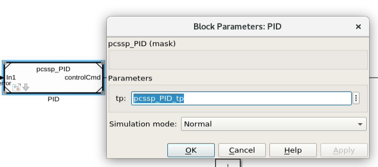
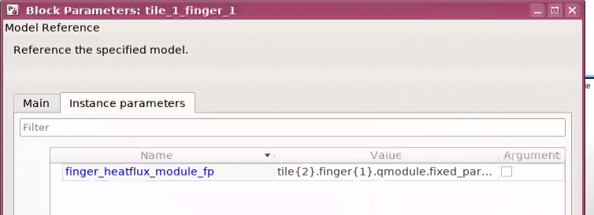

Module parameterization
=======================

.. automodule:: src

When referencing a module from a top model, the parameters in the referenced model are taken from the ``sldd`` that is attached to the child (referenced) model. This works for (most) applications where the parameters are constant between different instances of the model. However, in some cases, each instance of the referenced model needs different parameter values. For example, a model of a coil will have different *R,L* values for each specific coil, but the underlying model is exactly the same. Simulink supports this via model instance parameters. These allow the top model to inject parameters from the top to customize the behavior of each instance of the referenced model. 

PCSSP has methods to set and manipulate model instance parameters programmatically so you do not need to go into the inner bowels of your Simulink model. Nevertheless, these methods still rely on Simulink native capability, so we are not introducing additional complexity here.

The scheme has to be set up from two directions:

* The child model needs to define which parameters are to be instance parameters (to parameterize the model),

* The parent model needs to actually inject the parameters in the right instances referenced model.

.. note::
	Not all parameters in a Simulink model can be defined as model instance parameters: For example sample times or signal sizes have to be fixed across instances of the same model.

Defining model instance parameters
-----------------------------------

* initialize and setup your pcssp module

* Grab the available parameter structures from the ``sldd`` using the :meth:`pcssp_module.get_nominal_param_value` method.

* Configure the module to define this parameter as instance parameter via :meth:`pcssp_module.set_model_argument`. The  first argument is the fp structure grabbed in the previous step, the second the desired name of the model argument. This name has to be seen like a the model equivalent of a 'local function space' variable in usual programming practice. This name should be used throughout the referenced model.

* When you set a Simulink.Parameter as model instance parameter, PCSSP automatically sets the export class of the parameter such that it is preserved in the code generation process. The mask parameter therefore preserves in the production code and may be injected by MARTe2 or RTF as regular tunable parameter.

* From now on the model always uses the value in the model workspace when simulating it as standalone model. To avoid confusion and parameter conflicts it is best practice to remove the parameter in your module object definition script (the :meth:`pcssp_module.addfpinitfcn`  or :meth:`pcssp_module.addtunparamstruct` method).

* Optionally you can expose the model instance parameters to the user via a model mask. This mask can be created in the model explorer → model workspace → create system mask.

* save and close the model. This is required given that the definition of model instance parameters physically changes the model 

Top-down injection of model instance parameters
------------------------------------------------

* Initialize and setup your top model

* In case you defined a model mask in the referenced model, you can simply check whether the model instance parameters appear when you double click the referenced model (see below). Alternatively, you can check whether the model instance parameters of the child are visible and configured via :meth:`pcssp_top_class.print_model_arguments`. Note that the argument of this method points to the name of the module in the top model, which is unique and not the same as the module slx name!

* Customize the parameter structure you want to inject. The injection parameter needs to have the exact same structure, data types, sizes, etc. as the one defined by the child model. Of course, the values are different. The parameter you want to inject may be defined in the sldd of the top model, but also the base workspace

* inject the parameter via :meth:`pcssp_top_class.set_model_argument_value`; This effectively writes the parameter 'value' to the value field of the model instance parameter window below. This works both for masked referenced models and those without.

* When exclusively simulating the child model, the parameter value defined in the model workspace will be taken. However, when simulating the top model, the value defined in the model argument will be used.

	Model instance parameter ``tp`` that is exposed to the top model via a model mask. The injected value ``pcssp_PID_tp`` is taken from the sldd of the top model.

	Model instance parameter dialog window for a mask-less referenced model as seen from the top model. This menu can be accessed via right clicking on a model reference block → Block Parameters (ModelReference)

References
------------

* `Matlab documentation on model instance parameters <https://nl.mathworks.com/help/simulink/ug/parameterize-referenced-models.html>`_

* `Model instance parameters and code generation <https://nl.mathworks.com/help/rtw/ug/specify-instance-specific-parameter-values-for-reusable-referenced-models.html>`_

